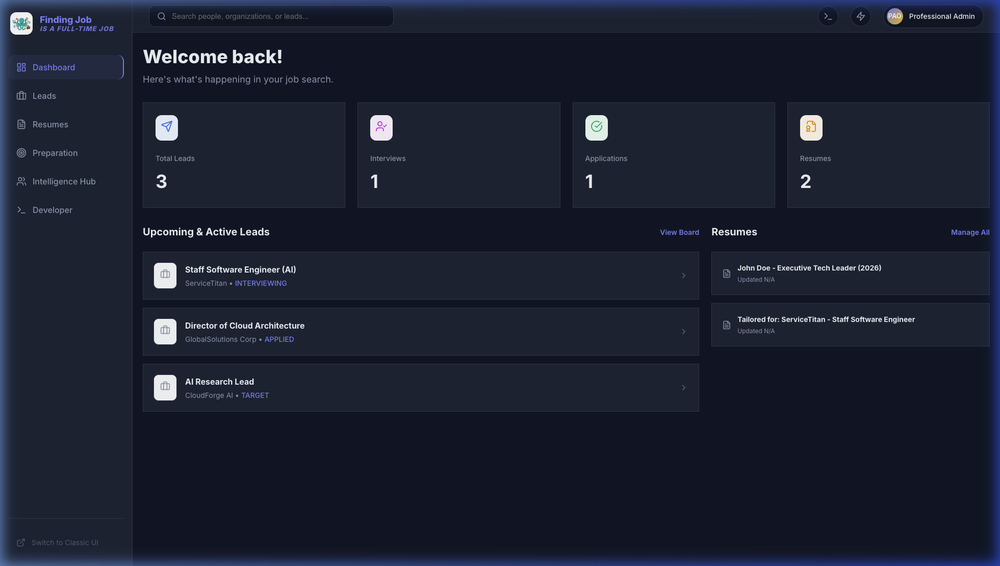
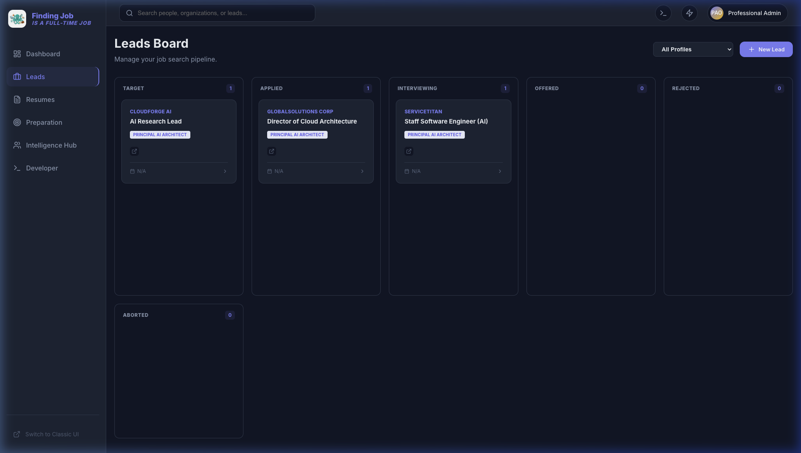
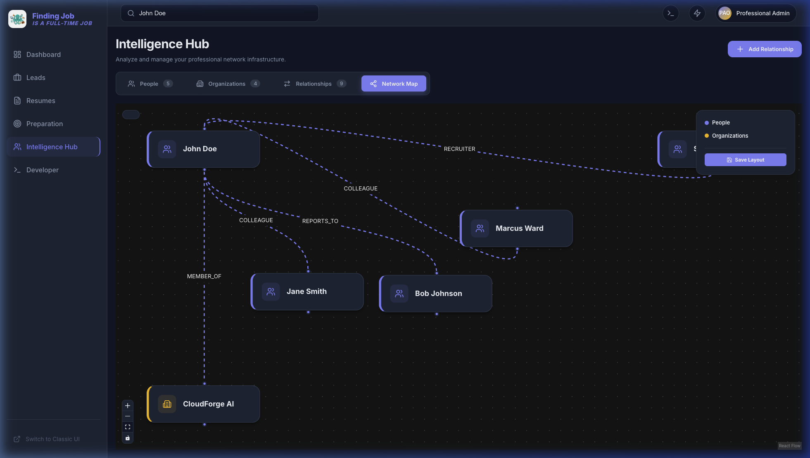
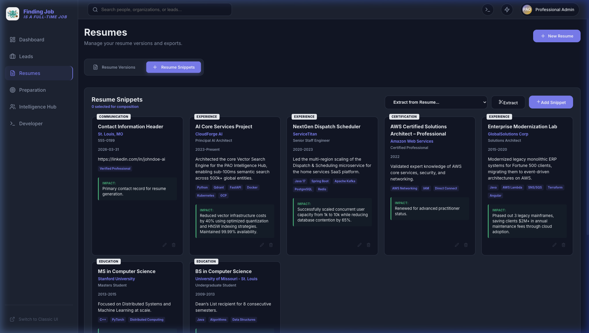
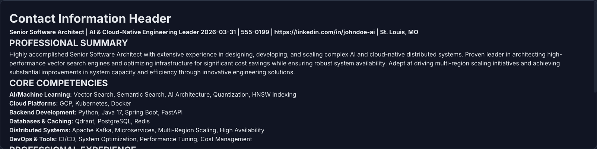
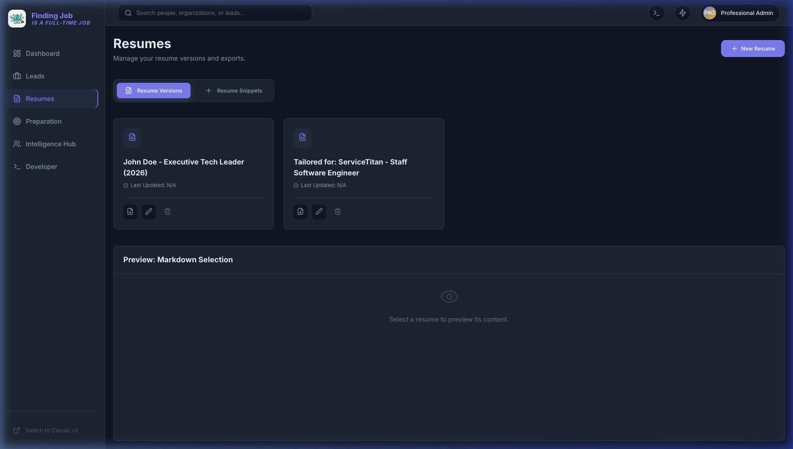
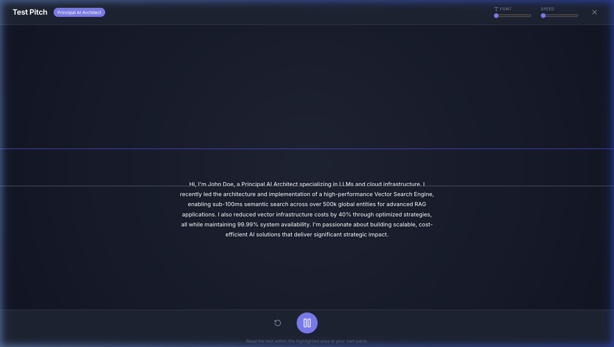

# PAO: Resilient AI Resume & Lead Intelligence System

PAO (Professional AI Orchestrator) is a high-fidelity, production-hardened platform designed to automate the job search lifecycle. By combining **Knowledge Graph Networking** with **Generative AI**, PAO transforms how you manage professional relationships, track job leads, and generate tailored, ROI-driven resumes.

## 🚀 Key Features

### 1. Command Center Dashboard
Get a high-level overview of your job search health, including lead metrics, upcoming interviews, and recently tailored resume versions.



### 2. Lead Intelligence Command Center
PAO automatically scrapes and extracts technical requirements from job URLs, allowing you to manage your pipeline across distinct phases.



### 2. Professional Knowledge Graph
Visualize and manage complex relationships between people and organizations (Recruiters, Colleagues, Reporting Lines).



### 3. ROI-Driven Resume Architect
Manage high-impact career snippets with automated technical tag extraction and ROI impact analysis.



### 4. Target-Oriented Resume Generation
Select professional snippets and PAO will synthesize a cohesive, high-impact resume tailored specifically to a target job lead (e.g., ServiceTitan).




### 5. Master-Class Practice Mode
Master your elevator pitch with a professional-grade, interactive teleprompter.



## 🛠️ Technology Stack

- **Backend**: Spring Boot 3.4.2 (Java 23) + Dual-Layer AI Resilience (Gemini / Ollama).
- **Frontend**: React (Vite) + Framer Motion + TanStack Query.
- **Database**: SQLite (Demo) / PostgreSQL (Prod).
- **AI Engine**: Google Gemini 2.5 Flash & Ollama (Failover).

## 📂 Project Structure

```text
.
├── pao-backend/          # Spring Boot Java Backend
├── pao-frontend-react/   # React Frontend (Vite)
├── devops/               # Dockerfiles and Deployment Scripts
├── docs/                 # Professional Documentation & Visual Assets
└── seed_demo_data.py     # High-fidelity Data Seeding Script
```

## 🏁 Quick Start

1. **Configure Environment**:
   Copy `.env.example` to `.env.local` and add your `GEMINI_KEY`.
2. **Deploy**:
   ```bash
   ./devops/deploy.sh
   ```
3. **Seed Demo Data**:
   ```bash
   python3 seed_demo_data.py
   ```
4. **Access**:
   [http://localhost:3012](http://localhost:3012)

## 📖 Detailed Documentation
Found in the [docs/](./docs) folder:
- [Technical Architecture](./docs/ARCHITECTURE.md)
- [User Guide](./docs/USER_GUIDE.md)
- [Major Features Walkthrough](./docs/WALKTHROUGH.md)
- [Development & Deployment](./docs/DEPLOYMENT.md)

---
*Built with ❤️ for resilient AI-assisted career engineering.*
