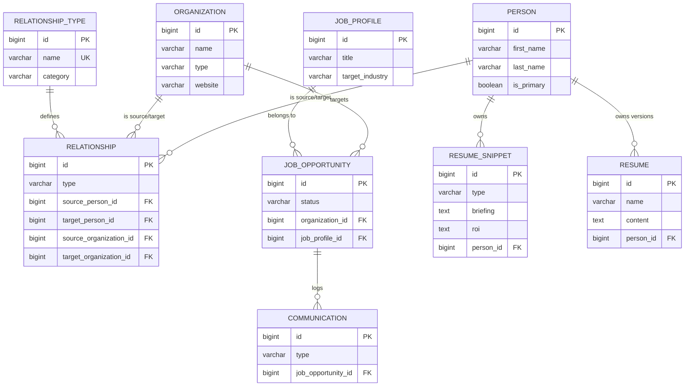

# PAO: Technical Architecture & Design

PAO (Professional AI Orchestrator) is a distributed platform designed for high-fidelity professional information management and AI-assisted career engineering.

## 1. System Components

The system architecture follows a 3-tier model with a focus on **AI Resilience**:

### 🧠 **Inference Engine (AIService.java)**
- **Cloud Layer**: Primary processing via **Google Gemini 2.5 Flash** (v1 API).
- **Local Layer**: Native failover to **Ollama** (`llama3.1:8b`) via `host.docker.internal`.
- **Logic**: Automated fallback on 503/429 errors ensures generation never fails even during quota limits or API outages.

### 🕸️ **Knowledge Graph (Backend Core)**
- **Entities**: 1st-class citizens for **Person**, **Organization**, and **Relationship**.
- **Schema Resilience**: Using SQLite for quick, stateful demo deployments while maintaining PostgreSQL compatibility for production scaling.
- **Persistence**: Managed via Spring Data JPA with robust audit logging (`task_logs`).

### 🎨 **Intelligent Frontend (React Hub)**
- **State Management**: React Query (TanStack) for resilient caching and re-fetching.
- **Micro-Animations**: Framer Motion for smooth transitions and hover states.
- **Teleprompter Logic**: Native JavaScript interval-driven scrolling with adjustable speed and font size (Practice Mode).

## 2. Professional Data Model

The core data structure revolves around entities and their interconnecting relationships:

## 3. Resilience & Hardening

PAO implements several production-grade hardening techniques:
- **Environment Externalization**: All sensitive keys and service URLs are strictly loaded from `.env.local` or environment variables.
- **Legacy Fallback**: Backend-level mapping (e.g., ID 1 -> ID 100) ensures historical hardcoded values do not cause 500 crashes.
- **Synchronous Persistence**: Automated seeding and database initialization on startup using `SystemSettingsService`.

## 4. Advanced AI Pipelines

### **Resume Architect Pipeline**
1. **Extraction**: AI scrapes the target job JD for core requirements.
2. **Matching**: Knowledge Engine finds high-impact `RESUME_SNIPPET` entities belonging to the user.
3. **Generation**: LLM synthesizes a Markdown resume, prioritizing ROI and technical stack alignment.

### **Lead Intake Scraper**
- Integrated **JSoup** scraping with **AI parsing** to transform unstructured company career pages into clean `JOB_OPPORTUNITY` records.

---
*PAO Architectural Documentation v2.5*
