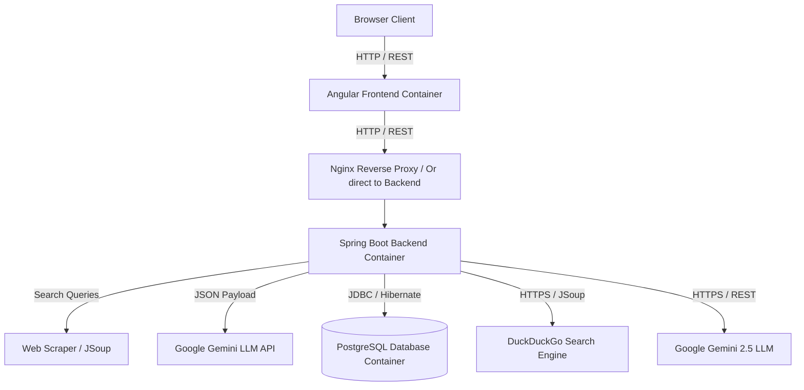

# PAO: Architecture Overview

PAO is architected as a modern, containerized, three-tier web application. The design strictly separates concerns between the user interface, business logic/data processing, and persistent storage.

## High-Level Architecture

The system consists of three primary components communicating over standard web protocols:

## Component Breakdown

### 1. Frontend (Client-side UI)
- **Technology:** Angular (v18, Standalone Components), TypeScript, HTML, CSS, Bootstrap 5.
- **Role:** Handles all user interactions, state management, and data visualization. 
- **Key Modules:**
  - **Routing:** Angular Router manages navigation between the Graph Hub, People, Organizations, Relationship Types, and the Job Seeker views.
  - **Services:** Angular Services (`PersonService`, `OrganizationService`, `RelationshipService`, `JobService`) encapsulate HTTP calls to the backend REST API via `HttpClient`.
  - **State Management:** Reactive programming using RxJS (`Observables`, `BehaviorSubjects`) to manage UI state and broadcast updates across components (e.g., refreshing lists after a deletion).
  - **Visualization:** Integrates `cytoscape` and `cytoscape-fcose` for rendering the complex connection nodes dynamically on an HTML5 Canvas, seamlessly interpreting styling config like edge directionality configurations from the database.

### 2. Backend (Server-side API)
- **Technology:** Java (JDK 23), Spring Boot 3, Spring Web, Spring Data JPA, Hibernate.
- **Role:** Serves as the central API gateway, enforcing business rules, data validation, and handling data persistence.
- **Key Modules:**
  - **Controllers:** Expose RESTful endpoints (e.g., `PersonController`, `OrganizationController`, `JobProfileController`, `CommunicationController`) mapping to standard HTTP verbs.
  - **Services:** Contain the core business logic. Modules like `OrganizationEnrichmentService` mock third-party web scraping. `ExternalIntegrationService` handles mocked ingestion (e.g., parsing Gmail for job communications). `RelationshipService` enforces strict structural database rules.
  - **Repositories:** Spring Data JPA interfaces that abstract raw SQL queries into Java method calls mapping to database operations.
  - **Entities:** JPA annotated plain old Java objects (POJOs) representing the database schema (including core nodes and job-tracking entities like `JobOpportunity`).

### 3. Database (Persistence Layer)
- **Technology:** PostgreSQL 15.
- **Role:** Provides robust, relational data storage.
- **Relational Integrity:** Utilizes table relationships (Foreign Keys) to link relationships to their respective entities.

## Deployment & Containerization

The architecture is fully containerized using Docker, managed via `docker-compose`. 
- **`pao-frontend` Service:** Runs the Angular application, typically served via a lightweight Nginx server in production or Angular CLI in development. Contains a proxy configuration to route `/api/*` requests to the backend.
- **`pao-backend` Service:** Runs the compiled Spring Boot `.jar` via a JDK runtime environment. Binds to port 8080.
- **`postgresdb` Service:** Runs the official PostgreSQL image, persisting data to a Docker volume to ensure data survives container restarts.
