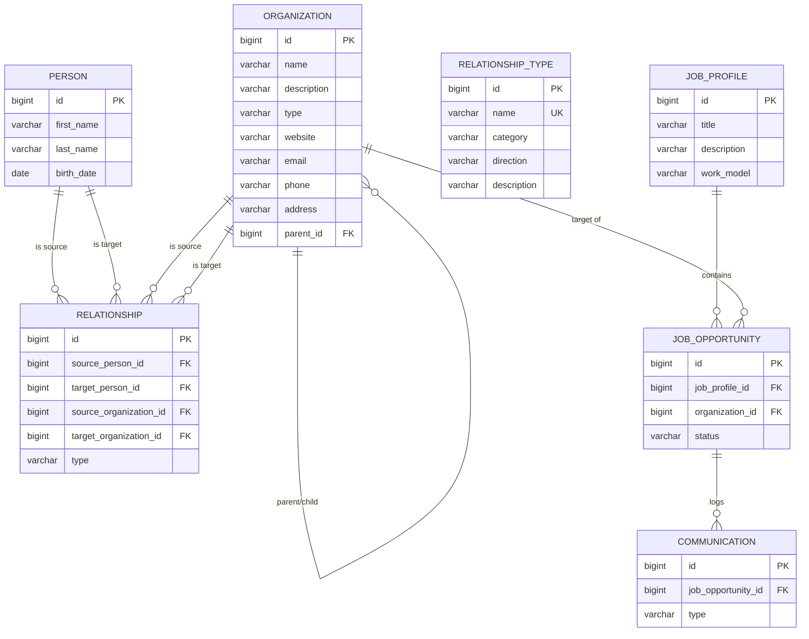

# PAO: Technical Design

This document details the technical implementation, data structures, and tech stack choices for the PAO application.

## 1. Technology Stack

### Frontend
* **Framework:** Angular 18 (using Standalone Components, dropping default NgModules).
* **Language:** TypeScript 5.x
* **Styling:** Bootstrap 5 (CSS framework), FontAwesome (icons).
* **Graphing:** Cytoscape.js with the `fcose` (Fast Compound Spring Embedder) layout extension for robust node layout calculation.

### Backend
* **Framework:** Spring Boot 3.4.2
* **Language:** Java 23
* **Data Access:** Spring Data JPA (Hibernate implementation).
* **AI Pipelines:** Google Gemini 2.5 LLM (REST API) & JSoup
* **Build Tool:** Maven

### Infrastructure & Database
* **Database:** PostgreSQL 15
* **Containerization:** Docker & Docker Compose

---

## 2. Data Model (Entity-Relationship Diagram)

The core data structure revolves around entities and their interconnecting relationships.

### 2.1 Entity Details
* **Person:** Represents an individual. 
* **Organization:** Represents a corporation or group. It defines a `type` string classifier (e.g., COMPANY, FAMILY) and includes a self-referencing relationship (`parent_id`) to support organizational hierarchies (trees).
* **RelationshipType:** A dynamic table replacing static Enums. Stores the allowed types of links (e.g., "WORKS_WITH"), overarching category (e.g., "BUSINESS"), and the `direction` of the vector (FORWARD, BACKWARD, BIDIRECTIONAL).
* **Relationship:** The edge definition. A polymorphic design where a relationship can connect a Person-to-Person, Org-to-Org, or Person-to-Org. It stores the explicit string `type` and foreign keys referencing the specific entities involved.
* **JobProfile:** High-level career plan tracked by the user.
* **JobOpportunity:** A specific job role targeted at a specific `Organization` categorized under a `JobProfile`.
* **Communication:** Interaction logs mapped to a specific `JobOpportunity`.

---

## 3. API Design (RESTful)

The backend exposes a standard REST API mapping CRUD operations to endpoints.

### 3.1 People (`/api/people`)
* `GET /`: Retrieve all people.
* `POST /`: Create a new person.
* `POST /{id}/enrich`: Run the AI enrichment pipeline (JSoup + Gemini) to auto-detect job title, contact info, and address.
* `PUT /{id}`: Update an existing person.
* `DELETE /{id}`: Delete a person.

### 3.2 Organizations (`/api/organizations`)
* `GET /`: Retrieve all organizations.
* `GET /roots`: Retrieve top-level organizations (where parent_id is null).
* `POST /`: Create a new organization.
* `POST /{parentId}/children`: Create an organization and automatically set its parent.
* `POST /{id}/enrich`: Run the JSoup scraper & Google Gemini LLM against DuckDuckGo to automatically detect and auto-populate contact details.
* `PUT /{id}`: Update an organization.
* `DELETE /{id}`: Delete an organization (logic handles checking and cleaning up associated Relationships to prevent constraint violations).

### 3.3 Relationships (`/api/relationships`)
* `GET /`: Retrieve all relationships.
* `GET /person/{personId}`: Fetch relationships involving a specific person.
* `GET /organization/{orgId}`: Fetch relationships involving a specific organization.
* `POST /`: Create a connection. The payload determines the `sourceType` and `targetType` explicitly. The service layer aggressively curates the network (e.g., dynamically ensuring a person only possesses one `MEMBER_OF` organization link concurrently by purging historical links, and automatically triggering reciprocal integration for `BIDIRECTIONAL` default tags like `FRIEND`).
* `DELETE /{id}`: Remove a relationship connection without affecting the underlying nodes.

### 3.4 Relationship Types (`/api/relationship-types`)
* `GET /`: Fetch all registered types.
* `POST /`, `PUT /{id}`, `DELETE /{id}`: Manage dynamic relationship categories.

### 3.5 Job Seeker (`/api/job-profiles`, `/api/job-opportunities`, `/api/communications`)
* **Profiles:** Full CRUD endpoints managing high-level career goals.
* **Opportunities:** Create links between Profiles and existing Organizations.
* **Communications:** endpoints mapped to Opportunities, including the custom trigger `POST /api/communications/import-gmail/{opportunityId}`.

---

## 4. Frontend Component Design

The Angular application is modularized into distinct routing components and generic shared components:

### 4.1 Page Routings
* `app.routes.ts` defines the mapping:
  * `/graph` -> `GraphComponent`
  * `/people` -> `PeoplePageComponent`
  * `/organizations` -> `OrganizationsPageComponent`
  * `/relationship-types` -> `RelationshipTypesComponent`
  * `/job-seeker` -> `JobSeekerPageComponent`

### 4.2 Key Components
* **GraphComponent:** The most complex UI component. 
  * Initializes the `cytoscape` canvas.
  * Subscribes via `forkJoin` to `PersonService`, `OrganizationService`, `RelationshipService`, and `RelationshipTypeService` to load the entire graph dataset asynchronously before rendering.
  * Manages state for side panels (`filters`, `node details`) and tracks `localStorage` preferences.
* **RelationshipManagerComponent:** Used as a child widget inside Person and Organization details. 
  * Displays lists of relationships actively linked to the parent entity.
  * Contains complex filtering logic to ensure that if a user is trying to connect a Person to an Organization, only "BUSINESS" or "OTHER" relationship types are selectable in the dropdown.

---

## 5. Build and Deployment Pipeline

### Compilation
1. **Frontend:** Angular CLI (`npm run build`) compiles the TypeScript application into optimized static HTML/JS/CSS bundles.
2. **Backend:** Maven (`mvn clean package`) compiles Java source code, downloads dependencies, and packages the application into an executable Spring Boot fat `.jar`.

### Container Startup (`docker-compose up`)
1. **PostgreSQL Container:** Initializes. If the database is empty, Spring Data JPA / Hibernate automatically executes auto-DDL to create all necessary schemas and tables based on the `@Entity` classes.
2. **Backend Container:** Boots into the JVM. The `DataInitializer.java` `@CommandLineRunner` triggers on startup to seed the database with baseline `RelationshipType` data if it detects the database relies on legacy mappings.
3. **Frontend Container:** Serves the frontend bundle.
